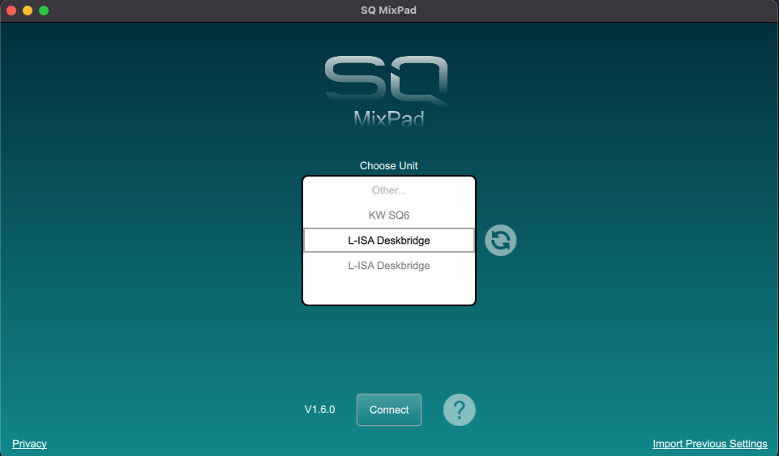

# lisa-deskbridge
Bridging custom controls to [L-ISA Controller](https://www.l-acoustics.com/products/l-isa-controller/)

Most immediate goal is to use existing/configurable controls of an Allen & Heath SQ6 mixing desk to control L-ISA Controller parameters, but in principle other controls could be used - or realized.

Open for other bridge adaptations ;)

https://github.com/tschiemer/lisa-deskbridge

## Compilation notes for Apple silicon 

The original `oscpack` (currently linked) will fail on Apple silicon. 

Use the changes as per [this pull request here](https://github.com/RossBencina/oscpack/pull/22).

## Usage

### macOS


### Command line interface

```shell
Usage: ./lisa-deskbridge-cli [-h|-?] [-v<verbosity>] [(-o|--bridge-opt <key1>=<value1>)*] [...] [<bridge>]
Bridge different custom control elements to comfortably control L-ISA Controller.
For further documentation see https://github.com/tschiemer/lisa-deskbridge

Arguments:
	 <bridge>                Bridge to use: Generic, SQ-Midi, SQ-Mitm

Options:
	 -h, -?                  Show this help
	 -v<verbosity>           Verbose output (in 0 (none), 1 (error), 2 (info = default), 3 (debug)
	 --lisa-ip               L-ISA Controller ip (default: 127.0.0.1)
	 --lisa-port             L-ISA Controller port (default: 8880)
	 --device-ip             Own OSC target IP as will be registered with L-ISA Controller (default: 127.0.0.1)
	 --device-port           Own OSC target port as will be registered with L-ISA Controller (default: 9000)
	 --device-id             Registration ID of this device with L-ISA Controller (range 1-10, default 1)
	 --device-name           Registration Name this device (default: L-ISA Deskbridge)
	 --claim-level-control   Claims for itself level control (can only be occupied by one device)
	 -o,--bridge-opt         Pass (multiple) options to bridge using form 'key=value'

Common bridge options:

	 lisa-controller-ip
	 lisa-controller-port
	 device-ip
	 device-port
	 device-id
	 device-name
	 claim-level-control

Specific bridge options:
	Generic Options:
		 midiin    Name of MIDI In port to use
		 midiout    Name of MIDI out port to use 

	SQ-Midi Options:
		 midiin    Name of MIDI In port to use (default: 'MIDI Control 1')
		 midiout    Name of MIDI out port to use (default: 'MIDI Control 1')

	SQ-Mitm Options:
		 mixer-ip=<mixer-ip>               IP of mixer (REQUIRED)
		 mitm-name=<name-of-mitm-service>  Name visible to mixing apps (default: L-ISA Deskbridge)


Examples:
./lisa-deskbridge-cli SQ-Midi #to use SQ-Midi bridge with default options
./lisa-deskbridge-cli -p 9000 --lisa-port 8880 --lisa-host 127.0.0.1 -o "midiin=MIDI Control 1" -o "midiout=MIDI Control 1" SQ-Midi # to use SQ-Midi bridge with custom options (which happen to be the default ones)
./lisa-deskbridge-cli -v2 -o mixer-ip=10.0.0.100 SQ-Mitm # SQ-Mitm bridge with INFO-level verbosity
```

## Bridges

### Generic

Create a virtual MIDI device `L-ISA Deskbridge` and optionally connects to MIDI in/out ports.

| Type           | Channel | Value1   | Value2    | Function                                      |
|----------------|---------|----------|-----------|-----------------------------------------------|
| Note On        | 1       | N (1-96) |           | Select source N                               |
| Note On        | 2       | N (1-96) |           | Select group N                                |
| Note On        | 3       | N        |           | Fire snapshot N                               |
| Note On        | 4       |          |           | TBD                                           |
| Note On        | 5       |          |           | TBD                                           |
| Control Change | 1       | 1        | relative* | Relative pan of selected sources              |
| Control Change | 1       | 2        | relative* | Relative width of selected sources            |
| Control Change | 1       | 3        | relative* | Relative depth of selected sources            | 
| Control Change | 1       | 4        | relative* | Relative elevation spread of selected sources | 
| Control Change | 1       | 5        | relative* | Relative pan spread of selected sources       |
| Control Change | 1       | 6        | relative* | Relative aux send of selected source S        |
| Control Change | 2       | 1        | absolute  | Master fader                                  |
| Control Change | 2       | 2        | absolute  | Reverb fader                                  |
| Control Change | 2       | 3        | absolute  | Monitor fader                                 |
| Control Change | 2       | 4        | absolute  | User fader 1                                  || Control Change | 2       | 1        | absolute  | Master fader                                  |
| Control Change | 2       | 5        | absolute  | User fader 2                                  |

*7bit signed int, ie 1-64 are positive values, 127-64 are negative values

#### SQ-Mitm

This bridge pretends to be a SQ-type mixing console. To use:

1. Make sure your computer is in the same network as the control port of the mixing console (example ip 10.0.0.2)
2. Run bridge passing it the mixer ip.
3. Start official SQ MixPad application (on the same or other device) and connect to mixer labelled `L-ISA Deskbridge`. *PLEASE NOTE* that per network interface there might be multiple instances of this bridge visible.



##### Source ID table

| Console Channel | Internal console ID | OSC Source ID |
|-----------------|---------------------|---------------|
| Input 1-40      | 0 - 39              | 1-40          |
| ST1             | 40                  | 41            |
| ST2             | 42                  | 43            |
| ST3             | 44                  | 45            |
| USB             | 46                  | 47            |
| FX Ret 1-8      | 64-71               | -> 49 - 56    |
| Group 1-12      | 72 - 83             | -> 57 - 68    |
| Aux 1-12        | 88 - 99             | -> 69 - 80    |
| FX Send 1-4     | 107-110             | -> 81 -84     |
| MainLR          | 104                 | -> 85         |
| Matrix 1-3      | 115-117             | -> 87 -       |

##### MIDI Config

| MIDI                    | L-ISA Controller command            | Alternate function*                               | 
|-------------------------|-------------------------------------|---------------------------------------------------|
| Channel 1 Note on 1     | Select 1 + Source select            | Toggle auto selection                             |
| Channel 1 Note on 2     | Add to Selection + Source select    |                                                   |
| Channel 1 Note on 3     | Snap + Source select                |                                                   |
| Channel 1 Note on 4     | Alternative function (keep pressed) |                                                   |
| Channel 1 CC 1 relative | Relative Pan                        |                                                   |
| Channel 1 CC 2 relative | Relative Pan Spread                 | Relative Width                                    |
| Channel 1 CC 3 relative | Relative Distance                   |                                                   |
| Channel 1 CC 4 relative | Relative Elevation                  | Relative Aux Send of last single source selection |
| Channel 2 Note on 1-96  | Select group 1-96                   |                                                   |
| Channel 3 Note on N     | Fire snapshot N                     |                                                   |

* MIDI 

#### SQ-Midi

Was originally designed for the use of a A&H SQ6 mixing desk where the custom controls look as follows: 


#### Setup + Technical Docs

##### Channel Selection

Creates a virtual MIDI device 'L-ISA Deskbridge' which receives MIDI note on messages that are interpreted as channel select. The semantics are as follows:

Note On Channel 1 Note N Velocity V -> Selected source N

Note: Using [Mixing Station](https://mixingstation.app/) along with a custom setup helps to get actual channel selection on the SQ6 mixing desk. Also see
the provided [settings file](resources/SQ6/MixingStation_AppSettings_MIDI_SQ6_L-ISA.msz).

##### Controls

Connects to MIDI in/out ports and uses incoming messages as commands.

Note: By default connects to 'MIDI Control 1' as created by the [A&H MIDI Control](https://www.allen-heath.com/hardware/controllers/midi-control/resources/) application. 

Realizes 4 function buttons, upto 96 group select buttons and 4 rotaries and master + reverb fader.

SQ6 configuration can be done/designed as follows:

| SQ6 Control          | MIDI           | Channel | Value1 | Value2    | Effect                                        | Condition          |
|----------------------|----------------|---------|--------|-----------|-----------------------------------------------|--------------------|
| Soft rotary button 1 | NoteOn         | 1       | 1      |           | Button 1 (no solo effect, see below)          |                    |
| Soft rotary button 2 | NoteOn         | 1       | 2      |           | Button 2 (no solo effect, see below)          |                    |
| Soft rotary button 3 | NoteOn         | 1       | 3      |           | Button 3 (no solo effect, see below)          |                    |
| Soft rotary button 4 | NoteOn         | 1       | 4      |           | ALT Button 4 (no solo effect, see below)      |                    |
| Soft rotary 1        | CC             | 1       | 1      | relative* | Relative pan of selected sources              |                    |
| Soft rotary 2        | CC             | 1       | 2      | relative* | Relative pan spread of selected sources       |                    |
| Soft rotary 3        | CC             | 1       | 3      | relative* | Relative depth of selected sources            |                    |
| Soft rotary 4        | CC             | 1       | 4      | relative* | Relative elevation spread of selected sources |                    |
| Soft rotary 2**      | CC             | 1       | 2      | relative* | Relative width of selected sources            | ALT button pressed |
| Soft rotary 4**      | CC             | 1       | 4      | relative* | Relative aux send of last one-selected source | ALT button pressed |
| Soft rotary 6***     | CC             | 1       | 6      | relative* | Relative width of selected sources            |                    |
| Soft rotary 8***     | CC             | 1       | 8      | relative* | Relative aux send of last one-selected source |                    |
| Soft button X        | NoteOn         | 2       | Y      |           | Select group Y                                |                    |
| Soft button X        | NoteOn         | 3       | Y      |           | Fire snapshot Y ****                          |                    |
| Soft button X        | Program Change | 1       | Y      |           | Fire snapshot Y ****                          |                    |
| Soft button X        | NoteOn         | 4       | 1      |           | All sources controlled by OSC                 |                    |
| Soft button X        | NoteOn         | 4       | 2      |           | All sources controlled by Snapshots           |                    |
| Soft button X        | NoteOn         | 4       | 11     |           | Fire previous snapshot                        |                    |
| Soft button X        | NoteOn         | 4       | 12     |           | Refire current snapshot                       |                    |
| Soft button X        | NoteOn         | 4       | 13     |           | Fire next snapshot                            |                    |
| MIDI Fader 1         | CC             | 2       | 0      | absolute  | Master fader                                  |                    |
| MIDI Fader 2         | CC             | 2       | 1      | absolute  | Reverb fader                                  |                    |
| MIDI Fader 3         | CC             | 2       | 2      | absolute  | Monitoring fader                              |                    |
| MIDI Fader 4         | CC             | 2       | 3      | absolute  | User fader 1                                  |                    |
| MIDI Fader 5         | CC             | 2       | 4      | absolute  | User fader 2                                  |                    |

*7bit signed int, ie 1-64 are positive values, 127-64 are negative values

**These rotaries have two functions depending on wether the ALT-Button is pressed or not.

***In case somebody has a SQ7 with 8 soft rotaries, all can be assigned directly without having to rely on the ALT button.

****At the time of this writing the used (and documented) OSC command does not L-ISA Controller (..) 

The effect of the buttons in combination with channel selects is as follows:

| Actions                                      | Effect                            |
|----------------------------------------------|-----------------------------------|
| Button 1 + Channel select N                  | Select source N                   |
| ALT + Button 1                               | Enable/Disable auto select follow |
| Button 2 + Channel select N                  | Add source N to selection         |
| ALT + Button 2 + Channel select N            | Remove souce N from selection     |
| Button 3 + Channel select N                  | Snap source N to speaker          |
| ALT + Button 3 + Channel select N            | Solo source N                     |
| ALT + Button 3 + Button 2 + Channel select N | Un-Solo source N                  |


## License

Copyright (C) 2025 Philip Tschiemer

[GNU Affero General Public License v3](LICENSE)

## Third Party

- [libremidi](https://github.com/celtera/libremidi)
- [oscpack](https://github.com/RossBencina/oscpack)

